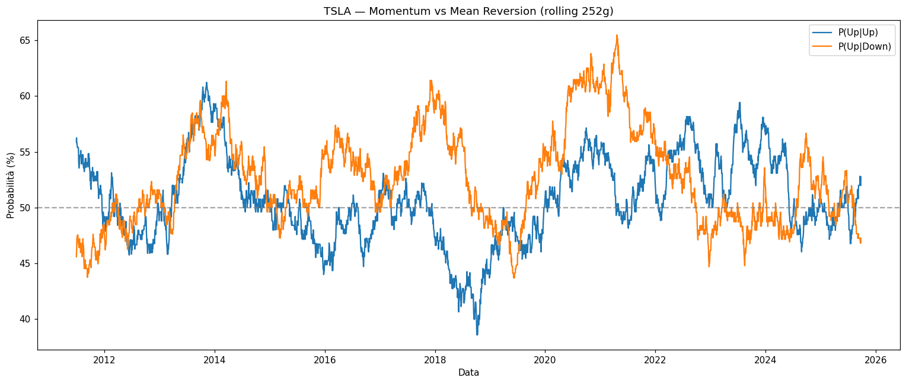
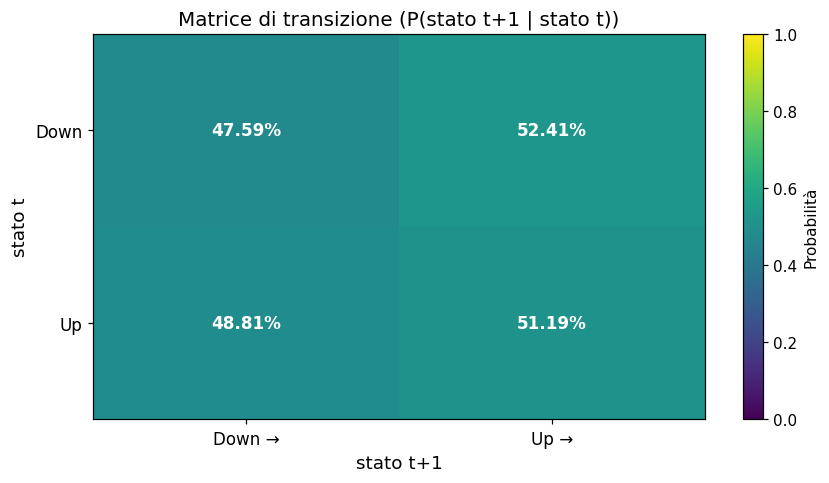
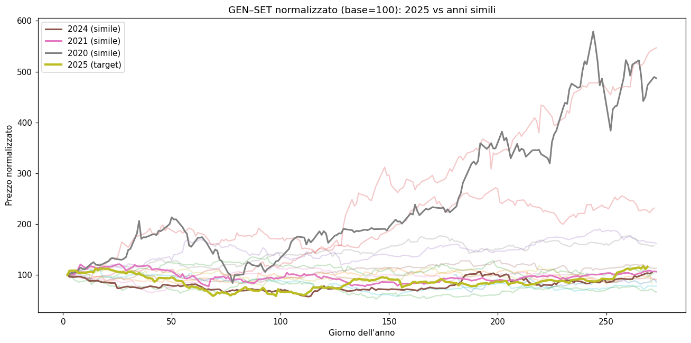

# Stock Seasonality Analysis

Python notebook for exploring financial market seasonality and behavioral patterns.  
Includes monthly returns, stationarity tests, trend/residual decomposition, historical comparisons, and price action studies.

## Features
- 📊 Boxplot of monthly returns (seasonality patterns)
- 📉 Augmented Dickey–Fuller test for stationarity
- 📈 Trend vs residual decomposition
- 🎃 October effect analysis
- 🔄 Transition probabilities (Up/Down days)
- 📉 Probability of rebound after down-streaks
- 📡 Autocorrelation of return signs
- 🔀 Momentum vs mean reversion (P(Up|Up), P(Up|Down))
- 💹 Price action comparisons across years

## Example Outputs

### Momentum VS Mean reverting


### Transition Matrix Heatmap


### Price Action Comparison (Similar Years)


---

## Requirements
- Python 3.9+
- `numpy`, `pandas`, `matplotlib`, `statsmodels`, `yfinance`, `scipy`

Install via:
```bash
pip install -r requirements.txt
